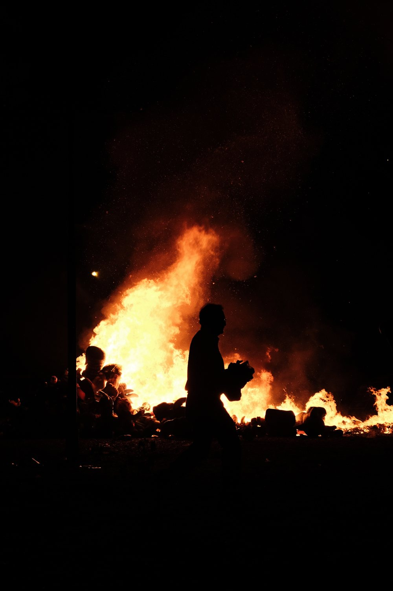

My research focuses on democracy and governance, with a regional emphasis on Latin America. I approach these questions as a scholar-practitioner: much of my work is designed to be useful to the organizations that support democracy and peace abroad.

## Democratic backsliding and renewal

I study how democracies erode under elected national executives and what strategies help them recover. With Aníbal Pérez-Liñán, I co-authored a brief on democratic backsliding and authoritarian resurgence in Latin America for NORC at the University of Chicago. My recent essay in the *Journal of Democracy* examines why constitutional change by referendum seldom delivers the democratic outcomes its proponents promise. Through the Global Democracy Conferences, I also contribute to a series of policy briefs that summarize findings from expert roundtables.

## Diffusion of democratic practices

In collaboration with Kellogg faculty, I map networks of democratic policy diffusion across countries. This work asks how institutional reforms and democratic practices travel between states, and what makes some countries more receptive than others.

## Social cohesion and peacebuilding

With Danice Brown Guzmán, I study the conditions under which peacebuilding programs sustain their effects years after funding ends. Our working paper introduces the concept of "project institutions": the durable structures, such as mediation committees and early warning systems, that programs leave behind. The paper draws on a qualitative comparative analysis of USAID-funded People-to-People programs in Nigeria, Colombia, Zimbabwe, and Bosnia and Herzegovina, and examines whether these institutions act as conditions for long-term attitudinal change and cooperation.

## Evaluation of international development programs

I have managed and contributed to retrospective impact evaluations of programs funded by USAID and CGIAR, covering emergency agriculture in South Sudan, peacebuilding, and climate resilience. I am interested in how long-term evaluation designs can inform the next generation of development and democracy programming.
