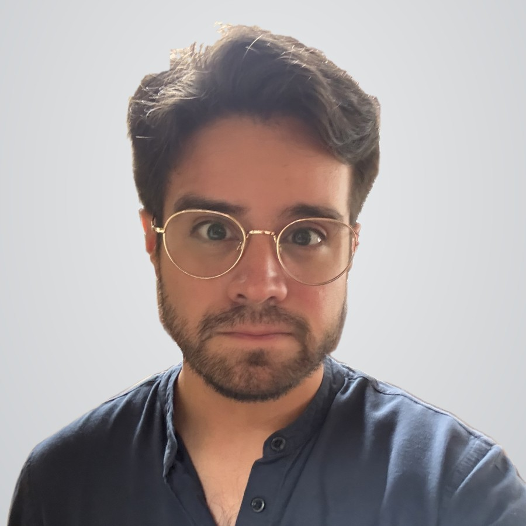

::: {.home}

::: {.left}

I am a political scientist, program evaluator, and manager. I study the (in)stability of democratic norms and associations, with a focus on Latin America.

::: {.detail}
I serve as the program manager for Global Democracy Research at the [Kellogg Institute for International Studies](https://kellogg.nd.edu), part of the [Keough School of Global Affairs](https://keough.nd.edu) at the University of Notre Dame. I curate the Institute's [Global Democracy Conferences](https://kellogg.nd.edu) and lead collaborations with democracy support organizations.

Previously, I managed impact evaluations at the [Pulte Institute for Global Development](https://pulte.nd.edu) and at the [International Republican Institute](https://www.iri.org).

My writing has appeared in the [Journal of Democracy](https://www.journalofdemocracy.org/online-exclusive/why-democracy-by-referendum-seldom-works/) online, and I have co-authored several [evaluation studies](publications.qmd) for the U.S. Agency for International Development (USAID) assessing the long-term effects of peacebuilding and emergency agriculture programs.

I have presented my work at the American Political Science Association (APSA), the Midwest Political Science Association (MPSA), and the American Evaluation Association (AEA).
:::

:::

::: {.right}

<a href="https://scholar.google.com/citations?user=4RTPRncAAAAJ" aria-label="Google Scholar" title="Google Scholar"><i class="bi bi-mortarboard-fill"></i></a>
<a href="https://www.linkedin.com/in/eduardopages96/" aria-label="LinkedIn" title="LinkedIn"><i class="bi bi-linkedin"></i></a>
<a href="mailto:epagesji@nd.edu" aria-label="Email" title="Email"><i class="bi bi-envelope-fill"></i></a>

::: {.detail}
My research examines democratic legacies from multiple scales. At the micro level, I examine the conditions under which associations created by international development programs are sustained after funding ends. Nationally, I study the determinants of serial constitutional replacement in Ecuador. Internationally, I infer latent networks of policy diffusion through which democratic institutions and practices spread across countries.

I hold a Master of Global Affairs from the University of Notre Dame, and degrees in political science and Latin American studies from the [Freie Universität Berlin](https://www.fu-berlin.de).

:::
:::

:::

## Contact me

::: {.contact}
Eduardo Pagés, Program Manager, Global Democracy Research 
Kellogg Institute for International Studies 
University of Notre Dame 
1130B Jenkins Nanovic Halls 
Notre Dame, IN 46556 
epagesji [at] nd.edu
:::
